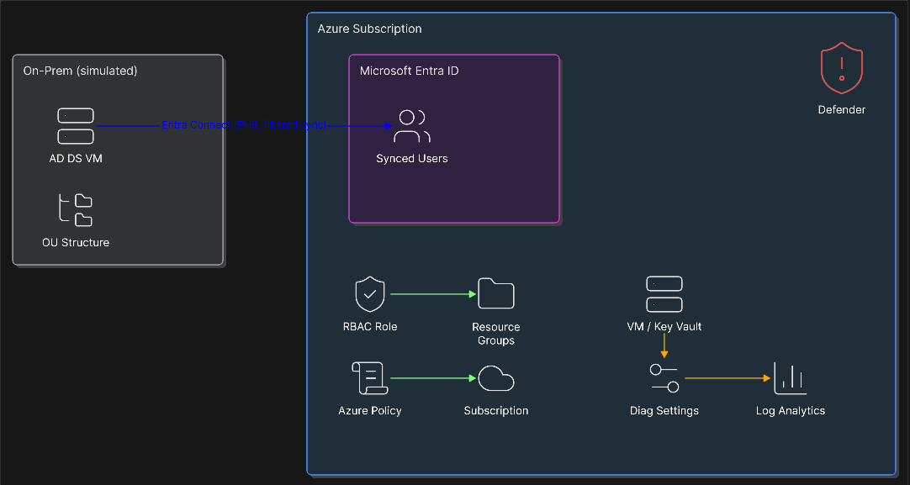

# Azure Hybrid Identity & Governance Lab

A hands-on lab simulating a hybrid identity environment with on-prem AD DS 
synced to Microsoft Entra ID, combined with RBAC least-privilege 
enforcement, Azure Policy governance, and Microsoft Defender for Cloud — 
built as part of my AZ-104 exam preparation and Cloud Security career track.

## 🏗️ Architecture

## 🎯 What this project demonstrates
- Designing a Management Group and tagged Resource Group structure
- Deploying and configuring an on-prem-style AD DS forest with OUs and users
- Implementing hybrid identity sync via Microsoft Entra Connect (Password Hash Sync, scoped OU sync)
- Diagnosing and resolving a real AD/Entra sync constraint (UPN uniqueness)
- Designing and empirically testing a custom least-privilege RBAC role
- Auditing pre-existing (system-managed) governance before building redundant controls
- Enforcing tagging governance via Azure Policy (Deny effect)
- Automating diagnostic log collection via Azure Policy (DeployIfNotExists effect)
- Reviewing Microsoft Defender for Cloud's Secure Score and remediating a real finding
- Working within real-world constraints: region restrictions, licensing limitations

## 📂 Structure
- `docs/` – step-by-step documentation with screenshots and key learnings
- `scripts/` – PowerShell / CLI scripts used throughout the lab
- `diagrams/` – architecture diagrams and screenshots

## 📖 Day-by-Day Documentation
1. [Management Group Hierarchy](docs/01-management-groups.md)
2. [Resource Groups & Naming Convention](docs/02-naming-convention.md)
3. [On-Prem AD DS Setup](docs/03-onprem-ad-setup.md)
4. [OUs & Test Users](docs/04-ous-and-users.md)
5. [Microsoft Entra Connect Setup](docs/05-entra-connect-setup.md)
6. [Sync Verification & Troubleshooting](docs/06-sync-verification-troubleshooting.md)
7. [RBAC Custom Role Design](docs/07-rbac-custom-role.md)
8. [Least Privilege Testing](docs/08-least-privilege-testing.md)
9. [Azure Policy Governance](docs/09-azure-policy-governance.md)
10. [Diagnostic Settings & Log Analytics](docs/10-diagnostic-settings-compliance.md)
11. [Conditional Access: Design & Licensing Limitation](docs/11-conditional-access-mfa.md)
12. [Defender for Cloud & Project Wrap-up](docs/12-defender-and-wrapup.md)

## 🔑 Key Learnings
- Azure Student subscriptions may carry system-managed policies (e.g., 
  region restrictions) — always audit existing governance before adding new controls
- UPN uniqueness is enforced at the AD forest level, not just at Entra ID sync time
- RBAC `AssignableScopes` defines where a role *can* be assigned, not where it *is* assigned — each scope needs its own explicit assignment
- Key Vault's RBAC permission model separates management-plane and data-plane access — even Owners need explicit data-plane role assignments
- Conditional Access requires Entra ID P1/P2 — Security Defaults is the free tier alternative

## 💰 Cost
Built entirely within the Azure for Students free credit. Total spend: 
approximately €[2.33] over the 12-day build (VM compute + minimal storage).

## 🛠️ Tools Used
Azure Portal, Azure CLI, PowerShell, Visual Studio Code, Microsoft Entra Connect, Git/GitHub