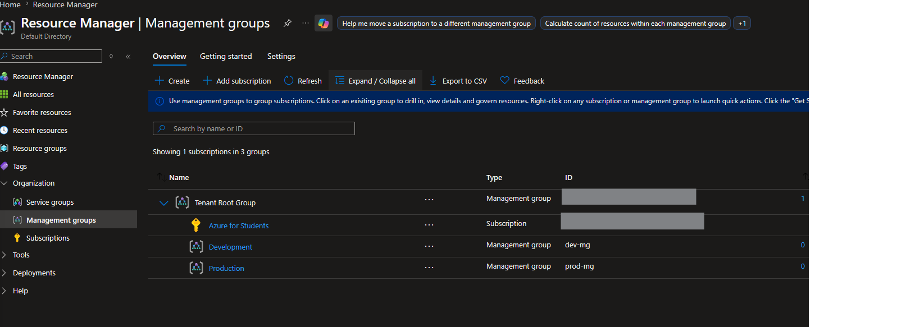
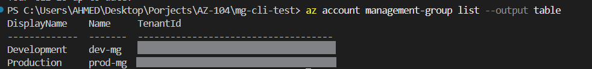

# Day 1: Management Group Hierarchy

## What I built
Created a Management Group hierarchy:
`Tenant Root → Production (prod-mg) / Development (dev-mg)`

## Why it matters
Management Groups allow RBAC roles and Azure Policies to be inherited 
across multiple subscriptions from a single assignment point — critical 
for governance at scale in enterprise environments.

## Steps taken
1. Created `prod-mg` and `dev-mg` under Tenant Root Group via Azure Portal
2. Verified structure using Azure CLI: `az account management-group list`
3. Moved subscription under `dev-mg` for testing purposes

## Key takeaway
Management Groups support up to 6 levels of nesting (plus root and 
subscription level). Policy/RBAC assignments cascade downward automatically.

