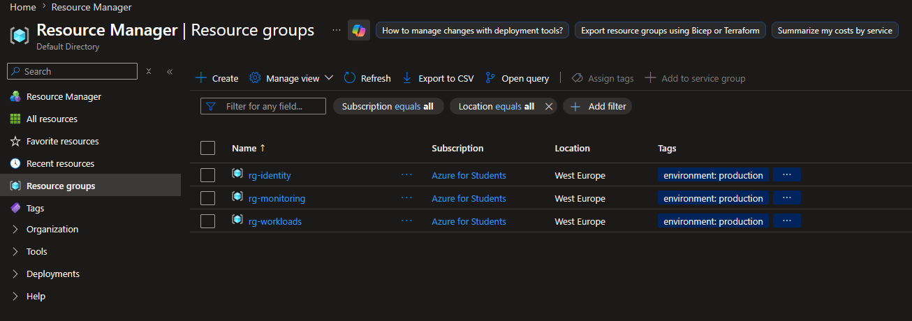
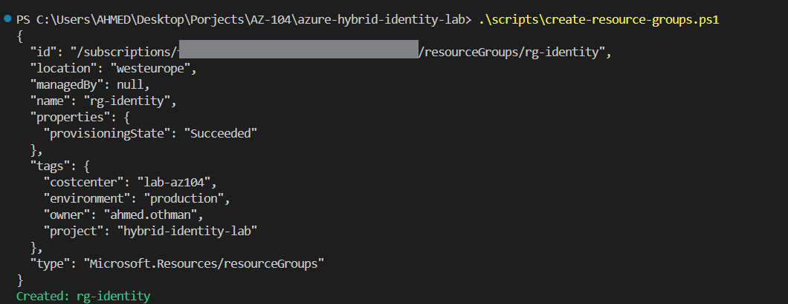
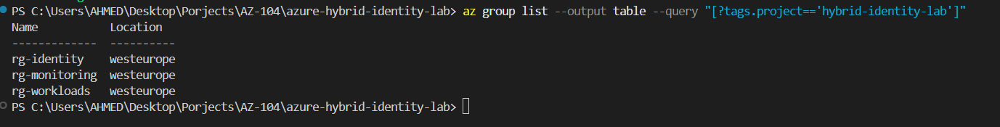

# Day 2: Resource Groups & Naming Convention

## What I built
Created three Resource Groups using both the Azure Portal and a reusable 
PowerShell script calling Azure CLI:
- `rg-identity` (production) – hosts the on-prem AD DS VM and identity-related resources
- `rg-monitoring` (production) – hosts Log Analytics / monitoring resources
- `rg-workloads` (development) – hosts test/demo workloads

## Naming Convention (based on Cloud Adoption Framework)

Pattern: `<resource-type>-<workload>-<environment>-<region>-<instance>`

Examples used in this lab:
| Resource | Name |
|---|---|
| Resource Group | `rg-identity` |
| Virtual Machine | `vm-addc-prod-we-01` |
| Virtual Network | `vnet-identity-prod-we-01` |

## Why it matters
A consistent naming convention makes resources identifiable at a glance — 
critical in larger environments where hundreds of resources exist across 
multiple teams. This is a common AZ-104 exam topic and a real-world 
governance best practice (CAF recommends resource-type prefixes).

## Tagging Strategy
| Tag | Purpose | Example |
|---|---|---|
| `environment` | Distinguish prod/dev | `production` |
| `owner` | Accountability | `ahmed.othman` |
| `costcenter` | Cost tracking | `lab-az104` |
| `project` | Grouping across RGs | `hybrid-identity-lab` |

## Key takeaway
Resource Groups are logical containers only — they don't have to match 
physical resource locations. All resources in a group should ideally share 
the same lifecycle (created and deleted together).

## Automation
See [`scripts/create-resource-groups.ps1`](../scripts/create-resource-groups.ps1) 
for the reusable CLI script used to provision these Resource Groups with 
consistent tagging.

