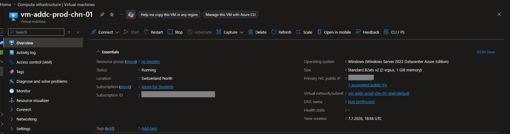
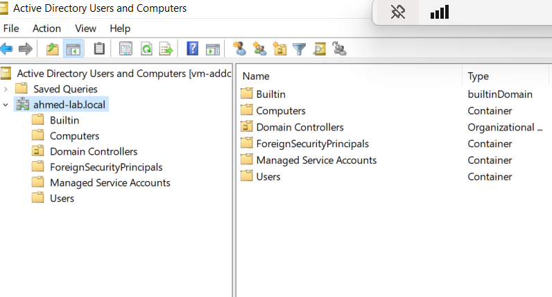
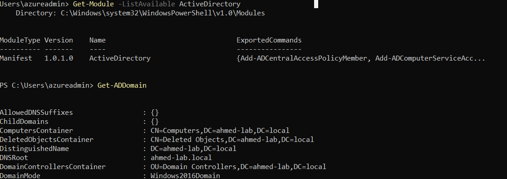
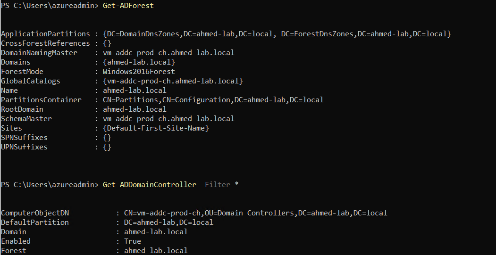

# Day 3: On-Premises AD DS VM Setup

## What I built
Deployed a Windows Server 2022 VM (Standard B2ats v2) in `rg-identity` to 
simulate an on-premises Active Directory Domain Services environment, 
then promoted it to a Domain Controller for a new forest.

## Environment details
| Property | Value |
|---|---|
| VM Name | `vm-addc-prod-chn-01` |
| Region | Switzerland North (required by Azure Student subscription) |
| VM Size | Standard B2ats v2 (2 vCPU, 1 GB RAM) |
| OS | Windows Server 2022 Datacenter Azure Edition |
| Forest Root Domain | `ahmed-lab.local` |
| NetBIOS Name | `AHMED-LAB` |
| Forest/Domain Functional Level | Windows Server 2016 |

## Steps taken
1. Deployed VM via Azure Portal with auto-shutdown enabled (cost control)
2. Connected via RDP
3. Installed the Active Directory Domain Services role via Server Manager
4. Promoted the server to a domain controller, creating a new forest 
   `ahmed-lab.local`
5. Verified the setup using both the AD Users and Computers GUI and 
   PowerShell (`Get-ADDomain`, `Get-ADForest`)

## Key concepts
- **Forest**: the top-level security boundary in Active Directory; can 
  contain multiple trusted domains
- **Domain Controller (DC)**: a server holding a writable copy of the AD 
  database, handling authentication requests
- **NetBIOS name**: legacy short name format still used for backward 
  compatibility with older systems/applications

## Region note
This lab uses Switzerland North instead of West Europe due to a region 
restriction on the Azure Student subscription. All resources (Resource 
Groups and VM) were kept consistent in this region.

## Cost management
- Used the smallest viable VM size (Standard B2ats v2) for a lab DC
- Enabled auto-shutdown at 22:00 daily to avoid idle running costs
- Standard SSD instead of Premium SSD for the OS disk

⚠️ This VM will be deleted at the end of the lab (Day 12) to avoid 
ongoing storage costs.

