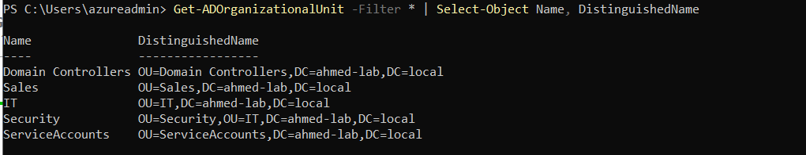
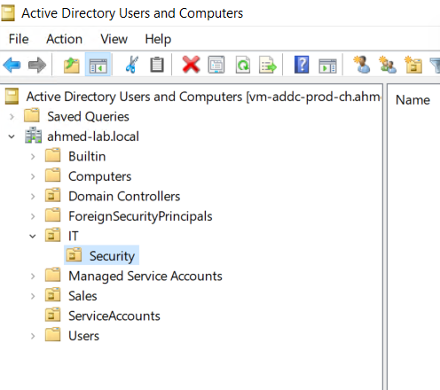
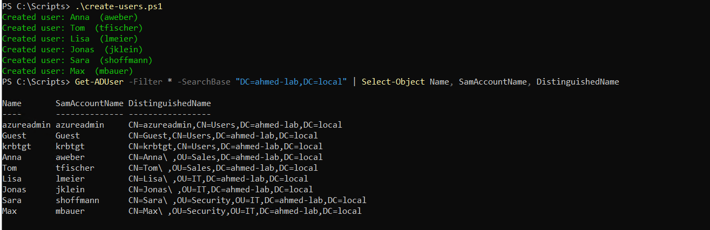

# Step 4: Organizational Units & Test Users

## What I built
Created a nested OU structure and populated it with 6 test users via a 
reusable PowerShell script, rather than creating them manually through 
the GUI.

## OU Structure
```text
ahmed-lab.local
├── OU=Sales
├── OU=IT
│   └── OU=Security
└── OU=ServiceAccounts
```

## Why OUs matter
OUs are used for **delegating administrative control** and **applying 
Group Policy Objects (GPOs)** — they are not a security boundary by 
themselves. This is a common point of confusion: OUs organize *management 
structure*, while security groups control *access*.

## Test Users Created
| Name | Username | OU |
|---|---|---|
| Anna Weber | aweber | Sales |
| Tom Fischer | tfischer | Sales |
| Lisa Meier | lmeier | IT |
| Jonas Klein | jklein | IT |
| Sara Hoffmann | shoffmann | Security |
| Max Bauer | mbauer | Security |

## Automation
See [`scripts/create-users.ps1`](../scripts/create-users.ps1). The script:
- Uses a hashtable array to define users declaratively (same pattern as 
  the Resource Group provisioning script from Day 2)
- Requires the ActiveDirectory PowerShell module (available on domain 
  controllers or machines with RSAT installed)
- Forces password change at first logon for security

## Key takeaway
Scripting user creation, even for a handful of accounts, demonstrates 
the same approach used at scale in real environments — onboarding 
hundreds of users via CSV import + PowerShell rather than manual GUI entry.



