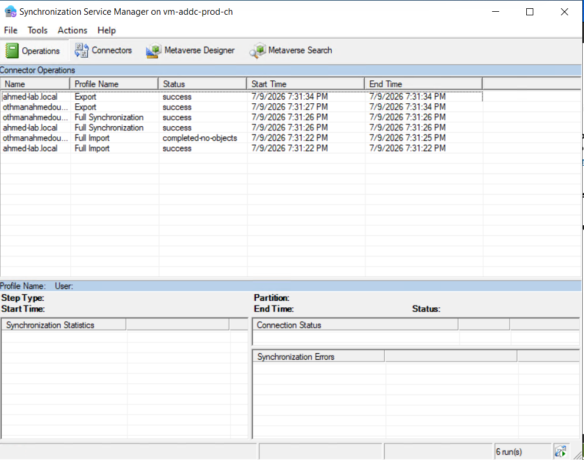

# Step 5: Microsoft Entra Connect Installation

## What I built
Installed Microsoft Entra Connect on the domain controller VM and 
configured it to synchronize a subset of on-premises Active Directory 
users to Microsoft Entra ID using Password Hash Synchronization.

## Configuration summary
| Setting | Value |
|---|---|
| Sign-in method | Password Hash Synchronization (PHS) |
| Sync scope | `IT` OU only (includes nested `Security` OU) |
| Excluded | `Sales`, `ServiceAccounts` OUs |
| Source anchor | ms-ds-consistency-guid (default) |

## Why Password Hash Sync
PHS was chosen over Pass-through Authentication or Federation because:
- Simplest to deploy and maintain
- Cloud authentication continues to work even if on-prem is unavailable
- Recommended default for most organizations per Microsoft guidance

## Why partial OU sync
Rather than syncing the entire directory, only the `IT` OU (and its 
nested `Security` OU) was selected. This reflects a common real-world 
pattern: organizations typically onboard specific departments to hybrid 
identity first, rather than exposing the full on-prem directory to the 
cloud immediately. `Sales` and `ServiceAccounts` remain on-prem only.

## Known limitation
`ahmed-lab.local` is not a verified custom domain in this Entra ID 
tenant (would require owning a real domain and DNS verification). 
Synchronization works correctly, but synced users cannot authenticate 
to cloud services with their on-prem UPN as a result. This is expected 
lab behavior, not a misconfiguration.

## Verification
- **On-prem**: Synchronization Service Manager showed successful Full 
  Import / Full Synchronization / Export operations with 4 user Add 
  operations
- **Cloud**: Confirmed in the Entra ID Users blade that `lmeier`, 
  `jklein`, `shoffmann`, and `mbauer` appear with Source = "Windows 
  Server AD", while `aweber` and `tfischer` (Sales OU) are correctly 
  absent

## Key takeaway
Entra Connect's OU/domain filtering is a practical governance tool — 
sync scope should be a deliberate decision, not "sync everything by 
default."

