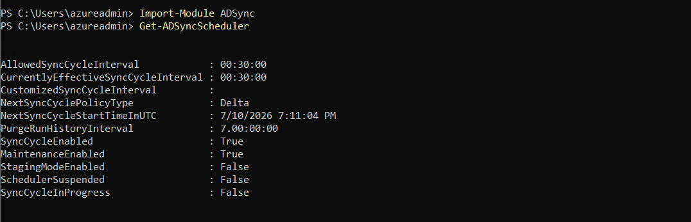
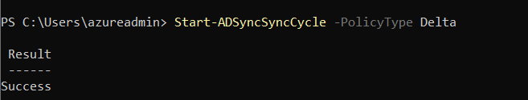
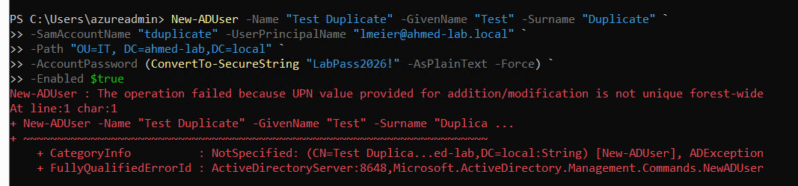

# Step 6: Sync Verification & Troubleshooting

## What I did
Went beyond basic sync verification to explore sync cycle internals, 
manually trigger sync cycles, and deliberately reproduce and resolve a 
common real-world sync error.

## Sync cycle internals
- Confirmed default Delta Sync runs automatically every 30 minutes 
  (`Get-ADSyncScheduler`)

  

- Manually triggered sync cycles on demand using 
  `Start-ADSyncSyncCycle -PolicyType Delta`

  

## Deliberate error: UPN uniqueness conflict

### Scenario
Attempted to create a new on-prem user with a UserPrincipalName that 
duplicated an existing user (`lmeier@ahmed-lab.local`), to observe how 
UPN conflicts are handled in a hybrid identity environment.

### Result
Active Directory itself rejected the operation at creation time:

## Why this matters
UPN uniqueness conflicts are among the most common Entra Connect sync 
errors in real environments, particularly during company mergers or 
multi-domain sync scenarios. Being able to read Synchronization Service 
Manager error details and resolve them is a practical skill, not just 
an exam topic.

## Note on Microsoft Entra Connect Health
Entra Connect Health (premium monitoring with dashboards and alerting) 
requires Entra ID P1/P2 licensing, not available on this Student tenant. 
In production, this would be the standard tool for proactive sync 
monitoring rather than manual checks via Synchronization Service Manager.

### Key learning
UPN uniqueness is enforced by Active Directory at the forest level, not 
just by Microsoft Entra ID at sync time. This means duplicate UPN issues 
are usually caught before they ever reach the cloud sync layer — except 
in multi-forest or multi-domain scenarios where two separate forests 
each independently allow the same UPN locally, and the conflict only 
surfaces when Entra Connect tries to sync both to a single tenant. That 
cross-forest scenario is the more common real-world cause of UPN sync 
errors (e.g., during company mergers), rather than single-forest conflicts 
like this one.

## Why this matters
Understanding *where* in the pipeline a given identity constraint is 
enforced (on-prem AD vs. Entra ID vs. Entra Connect sync engine) is 
important for effective troubleshooting — the same symptom (a UPN 
conflict) can originate at different layers depending on the environment.

