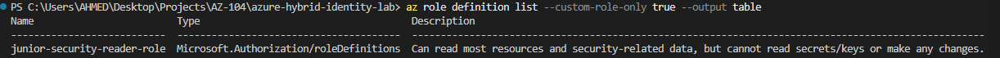
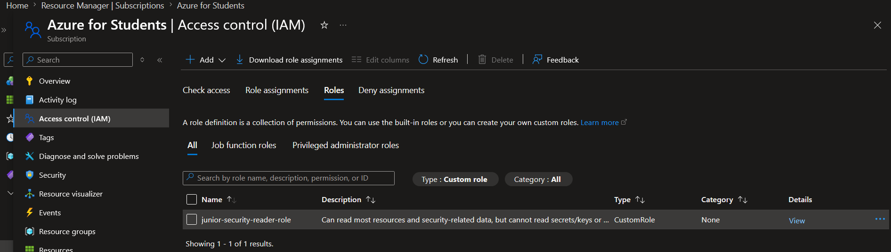

# Step 7: RBAC Custom Role Design

## What I built
Explored Azure's built-in role hierarchy, then designed and deployed a 
custom RBAC role (`Junior Security Reader`) scoped to specific Resource 
Groups, with explicit denial of sensitive data access.

## Built-in role hierarchy
| Role | Capability |
|---|---|
| Reader | Read-only access to all resources |
| Contributor | Read/write access, but cannot assign roles to others |
| Owner | Read/write access + can assign roles to others |

## Custom role: Junior Security Reader
| Property | Value |
|---|---|
| Actions | `*/read` (read access to all resource types) |
| NotActions | Key Vault secrets/keys, Storage account key listing |
| DataActions | None (no data-plane access at all) |
| Assignable Scopes | `rg-identity`, `rg-monitoring` only |

## Setup note
Replace `<YOUR-SUBSCRIPTION-ID>` in `junior-security-reader-role.json` 
with your own subscription ID before deploying:
```powershell
az account show --query id -o tsv
```

See [`scripts/junior-security-reader-role.json`](../scripts/junior-security-reader-role.json).

## Why a custom role instead of the built-in Security Reader
The built-in `Security Reader` role already covers similar ground. This 
custom role was built primarily to practice the mechanics of RBAC role 
definitions (Actions vs. NotActions vs. DataActions) and to explicitly 
scope assignability to only two Resource Groups, rather than allowing 
subscription-wide assignment.

## Key concept: management plane vs. data plane
`Actions`/`NotActions` govern management plane operations (via Azure 
Resource Manager — e.g., seeing that a Key Vault exists). `DataActions`/
`NotDataActions` govern data plane operations (e.g., reading the actual 
secret value inside that Key Vault). These are controlled independently 
— a role can allow visibility into a resource's existence while fully 
blocking access to its contents.

## Test identity note
Synced on-prem users (from Day 5) cannot authenticate to Entra ID due to 
the unverified `ahmed-lab.local` domain. A cloud-native test user 
(`rbactestuser@<tenant>.onmicrosoft.com`) was created specifically for 
RBAC assignment testing, since it requires an identity capable of actual 
cloud sign-in — a practical consequence of the Day 5 limitation.

## Next step
Role has been assigned to the test user at the `rg-identity` scope. 
Actual access testing (verifying what the role does and doesn't allow) 
is documented in Day 8.



