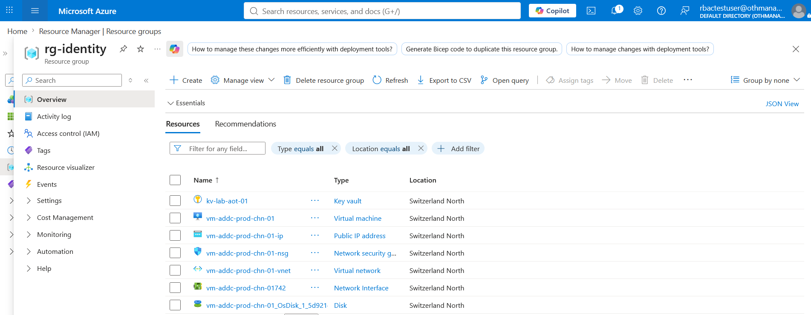
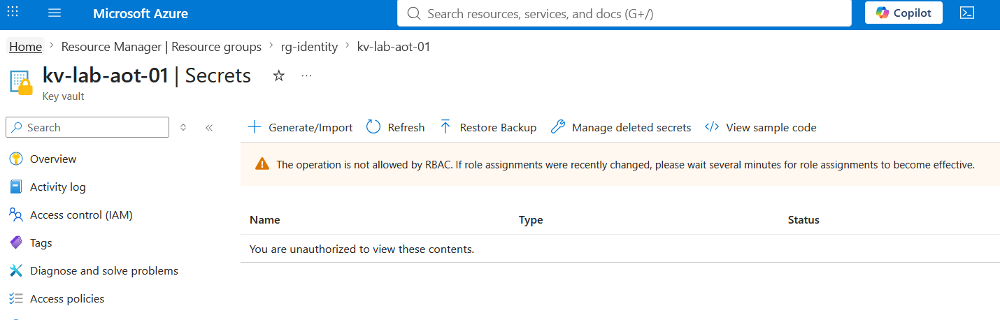

# Step 8: Least Privilege Testing

## What I did
Logged in as the `rbactestuser` cloud-native test account (assigned the 
`Junior Security Reader` custom role from Day 7) and empirically verified 
both allowed and blocked actions, rather than relying on the role 
definition alone.

## Allowed (verified)
| Action | Result |
|---|---|
| View `rg-identity` | ✅ Visible |
| View `rg-workloads` and `rg-monitoring` (not in assignable scope) | ❌ Not visible |
| View VM properties, networking, disk config | ✅ Read-only access works |
| View Key Vault existence and configuration | ✅ Management plane read allowed |

## Setup note: Key Vault RBAC permission model
Attempting to set a secret with `az keyvault secret set` initially failed, 
even when signed in as an account with Owner/Contributor rights on the 
subscription. This Key Vault uses the **Azure RBAC permission model** 
for data plane access (the current default for new vaults) rather than 
the legacy Access Policies model. Under this model, management-plane 
rights (Owner, Contributor) do not automatically grant data-plane rights 
to secrets — a separate, explicit role assignment is required:

```powershell
az role assignment create \
  --role "Key Vault Secrets Officer" \
  --assignee-object-id "<YOUR-USER-OBJECT-ID>" \
  --assignee-principal-type "User" \
  --scope "/subscriptions/<YOUR-SUBSCRIPTION-ID>/resourcegroups/rg-identity/providers/Microsoft.KeyVault/vaults/kv-lab-<yourinitials>01"
```

To find your own object ID:
```powershell
az ad signed-in-user show --query id -o tsv
```

This is a real-world gotcha worth remembering: **Key Vault data-plane 
access is governed independently of general subscription/resource-group 
RBAC roles**, regardless of the permission model in use. It directly 
reinforces the Actions vs. DataActions distinction from Day 7 — this 
time experienced from the admin side, not just the test-user side.

## Blocked (verified)
| Action | Result |
|---|---|
| Stop/restart the VM | ❌ Blocked — no write permissions |
| Create a new resource | ❌ Blocked — no write permissions |
| Assign roles to other users | ❌ Blocked — Reader-tier roles cannot grant access |
| Read a Key Vault secret's value | ❌ Blocked — `NotActions` explicitly denies this |

## Key finding
The Key Vault test is the clearest proof of the Actions vs. DataActions 
distinction from Day 7: the test user could see that the Key Vault 
*existed* and view its configuration (management plane, allowed by 
`*/read`), but could not read the actual secret *value* inside it 
(blocked by the `NotActions` entry). This confirms the role behaves 
exactly as designed, not just as documented.

## Verification method
Rather than reasoning about permissions theoretically, testing was done 
by actually signing in as the test identity in an isolated browser 
session — the only reliable way to validate RBAC given how scope 
inheritance and multiple assignment layers can interact in ways that 
are easy to miscalculate on paper.



