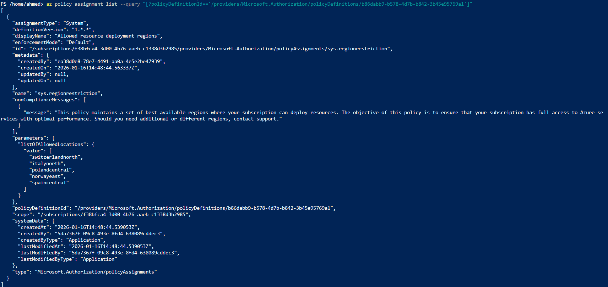

# Step 9: Azure Policy for Governance

## What I built
Investigated region governance on the subscription and assigned a 
built-in Azure Policy requiring an `environment` tag on all Resource 
Groups — enforcing the Day 2 tagging strategy automatically rather than 
relying on manual discipline. To see a step-by-step check [`docs/azure-policy-governance-guide.md`](../docs/azure-policy-governance-guide.md)

## Policy vs. RBAC
RBAC controls *who* can perform *which actions*. Azure Policy controls 
*what configurations resources are allowed to have*, independent of who 
is creating them — even a subscription Owner can be blocked by a Policy 
denying a specific region or missing tag. The two systems are 
complementary and evaluated independently.

## Policy 1: Region Restriction (Pre-existing System Policy)

Rather than creating a new "Allowed locations" policy from scratch, 
discovered that Azure already enforces a **system-managed policy** 
("Allowed resource deployment regions") on this Student subscription, 
categorized as `"System Policy"` in its metadata — indicating it's 
Microsoft-managed, not something a subscription owner created.

### Discovery
```powershell
az policy assignment list --query "[?policyDefinitionId=='/providers/Microsoft.Authorization/policyDefinitions/b86dabb9-b578-4d7b-b842-3b45e95769a1']"
```

### Why this matters
This explains why VM/resource deployment outside Switzerland North was 
never actually observed being blocked by a self-created policy in 
earlier days — it was already prevented at a higher level by Microsoft's 
own subscription governance. This is a useful real-world lesson: 
**before assuming you need to build a control, check whether one already 
exists.** A redundant policy adds complexity without adding protection, 
and in enterprise environments, duplicate/conflicting policies across 
scopes are a common source of confusion during audits.

### Effective outcome
Region restriction is confirmed active and enforced at the subscription 
level, satisfying the Day 9 governance goal without requiring a custom 
assignment.

## Policy 2: Enforce Mandatory Tagging

Unlike the region restriction, Microsoft does not pre-enforce any 
tagging convention — this policy was created and assigned manually to 
enforce the Day 2 tagging strategy (`environment` tag) automatically.

### Assignment
| Property | Value |
|---|---|
| Policy | Require a tag on resource groups (built-in) |
| Scope | Subscription |
| Parameter | Tag Name = `environment` |

```powershell
az policy definition list --query "[?displayName=='Require a tag on resource groups'].{Name:name, DisplayName:displayName}" -o table

az policy assignment create `
    --name "require-env-tag-rg" `
    --display-name "Require environment tag on RGs" `
    --policy "<DEFINITION-ID>" `
    --params '{ "tagName": { "value": "environment" } }' `
    --scope "/subscriptions/<YOUR-SUBSCRIPTION-ID>"
```

### Verification
- Confirmed the policy **blocks** Resource Group creation without an 
  `environment` tag (`RequestDisallowedByPolicy` error)
- Confirmed the policy **allows** Resource Group creation once the tag 
  is supplied:
```powershell
az group create --name rg-policy-test-tagged --location switzerlandnorth --tags environment=development
```
- Checked the Compliance dashboard to review existing resource 
  compliance state against the new policy

## Key takeaway
Policy enforcement moves governance from "hope everyone remembers the 
tagging convention" (Day 2's manual approach) to "the platform enforces 
it automatically" — a meaningful maturity step in real environments, 
especially at scale where manual discipline doesn't hold. Just as 
important: auditing for *existing* governance (like the system-managed 
region policy) before adding new controls avoids unnecessary redundancy.


