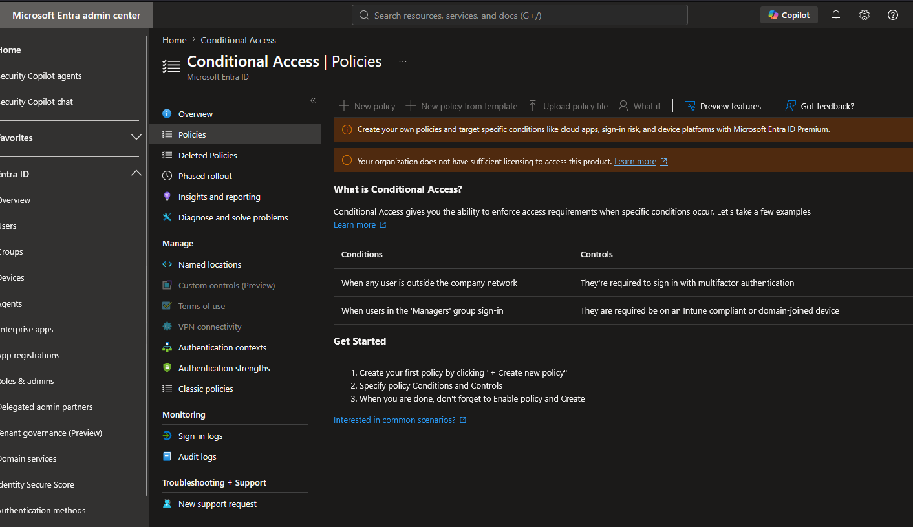
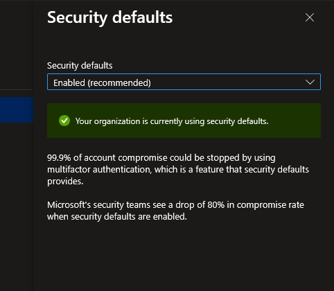

# Step 11: Conditional Access - MFA for Admins (Design & Licensing Limitation)

## What happened
Attempted to create a Conditional Access policy requiring MFA for the 
Global Administrator role. Discovered that Conditional Access requires 
Microsoft Entra ID P1 (or P2), which is not included in this Azure 
Student subscription's default licensing.

## Licensing check
Confirmed via Portal (Entra ID → Licenses → All products) and by 
attempting to navigate to Conditional Access directly, which returned 
an upgrade prompt rather than the policy creation interface.

## What this means practically
Conditional Access is a **premium feature** — this is an important 
distinction from Security Defaults, which is free on every tenant tier 
regardless of license. Organizations without P1/P2 rely on Security 
Defaults as their baseline MFA enforcement instead.

## Current tenant MFA posture (Security Defaults)
Checked Security Defaults status as the fallback baseline available 
without a premium license:
- Status: [On/Off — fill in what you found]

## Policy design (specification, not deployed)
Despite the licensing limitation, designed the policy that would be 
deployed with P1/P2 available:

| Setting | Value |
|---|---|
| Name | `CA01-Require-MFA-Admins-ReportOnly` |
| Users | Directory role: Global Administrator |
| Cloud apps | All cloud apps |
| Grant control | Require multifactor authentication |
| Mode | Report-only (initial rollout), then enforced after review |

Targeting by **directory role** rather than named individual users was 
a deliberate design choice — a more scalable pattern where future admins 
are automatically covered without policy edits.

### Why Report-only first (design rationale)
Report-only mode evaluates a policy against real sign-ins and logs the 
outcome without enforcing anything — the safe, standard practice for 
testing new Conditional Access policies before going live, avoiding the 
risk of accidentally locking out admins with a misconfigured policy.

## Break-glass accounts (concept, documented)
Real environments maintain at least two emergency-access "break-glass" 
accounts, deliberately excluded from Conditional Access policies, with 
strong offline-stored credentials — used only if a CA misconfiguration 
or MFA outage locks out all other admins. Relevant context for any real 
CA deployment, independent of this lab's licensing constraint.

## Key takeaway
Encountering and correctly diagnosing a licensing boundary is itself a 
realistic operational skill — knowing *which* Azure/Entra features 
require which license tier (and how to check) is a practical, frequently 
tested piece of AZ-104 knowledge, distinct from knowing how to configure 
the feature itself.

