# Azure Policy Governance Guide
## Lab Walkthrough: Enforcing Region Restrictions and Mandatory Tagging

This guide documents the implementation of **Azure Policy** within the lab subscription. It covers the conceptual distinction between Policy and RBAC, followed by the configuration of two policy assignments: a region-restriction guardrail to protect the Student subscription credit, and a mandatory-tagging rule to enforce the CAF naming convention established earlier in the project.

---

### Part 1: Understand Policy vs. RBAC
Before building anything, it is worth being explicit about a distinction that comes up frequently in both real-world governance design and the AZ-104 exam.

#### 💡 Technical Know-How (AZ-104 Reference)
**RBAC** controls *who* can perform *which actions* — it is identity-based access control. **Azure Policy** controls *what configurations or states* resources are allowed to have, regardless of who is creating them. Even a subscription **Owner** with full RBAC rights can be blocked from creating a resource in a disallowed region if a Policy denies it.

Policy operates independently of, and beneath, RBAC: RBAC says *"you're allowed to create resources."* Policy says *"but only ones that look like this."*

Policies are attached to a **scope** (Management Group, Subscription, or Resource Group) via a **Policy Assignment**, and evaluate resources either:
* **At creation time** — can block/deny the operation, or
* **Continuously** — can flag existing non-compliant resources without blocking them.

---

### Part 2: Policy 1 — Restrict Allowed Region
This policy directly protects the Student subscription credit by eliminating the possibility of accidental resource creation outside `Switzerland North`.

1. Portal → search **"Policy"** → **Definitions** (left menu).

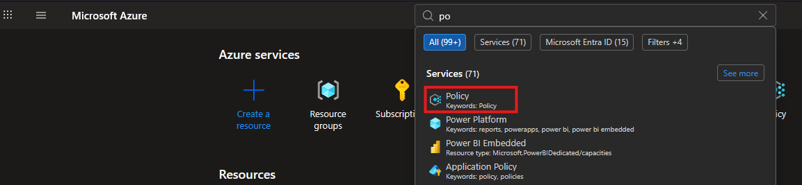

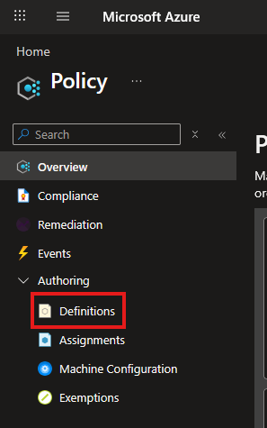

2. Search the built-in definition: **"Allowed locations"**.

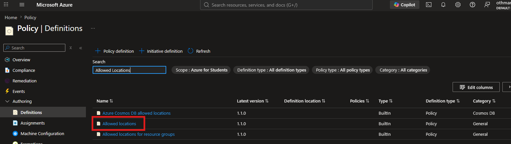


3. Click it → **Assign**.

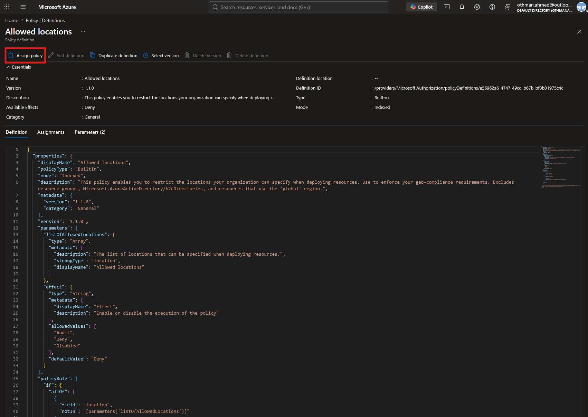

4. Scope: set to the subscription *(kept at subscription level rather than Management Group for simplicity in this lab)*.


5. Assignment name: `Restrict to Switzerland North`.

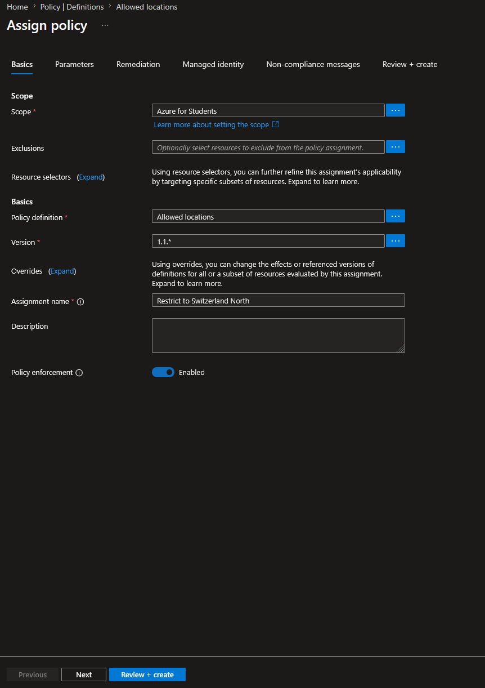


6. Go to the **Parameters** tab → *Allowed locations* → select only `Switzerland North`.

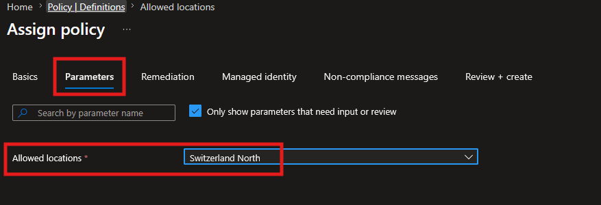

7. Non-compliance message: `Only Switzerland North is allowed for this subscription (Student account region restriction).`

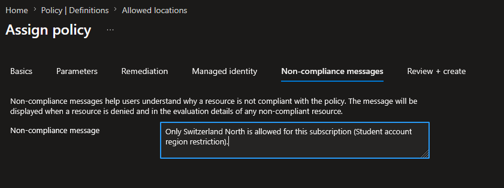


8. Click **Review + Create**.

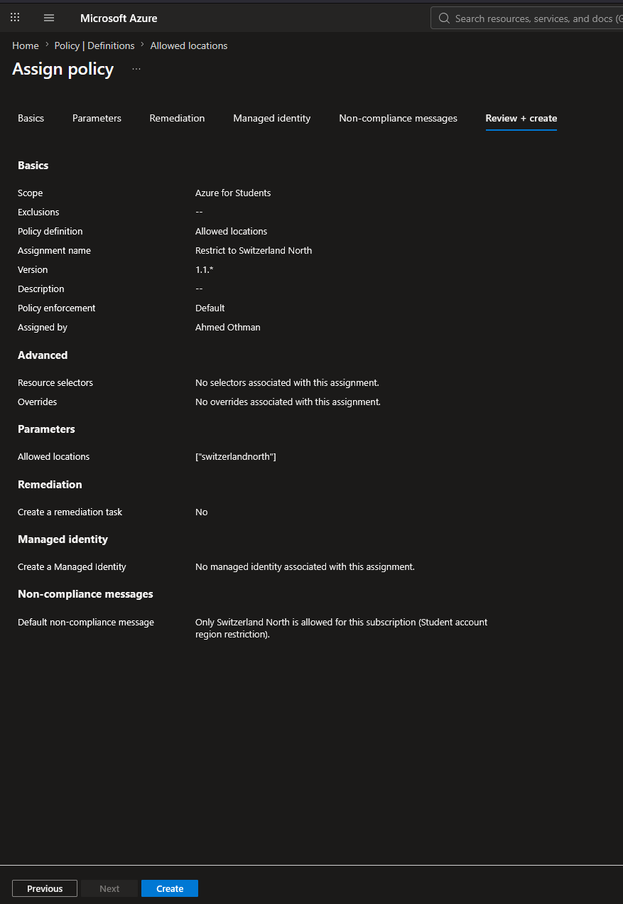

9. Check the policy status: At first it should be **Not started**

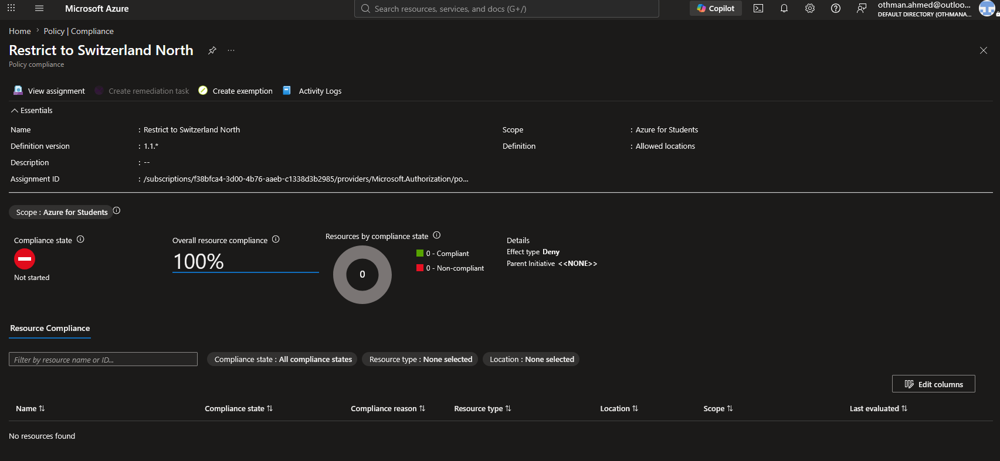

wait 2 - 5 minutes, then it should change to **Compliant**

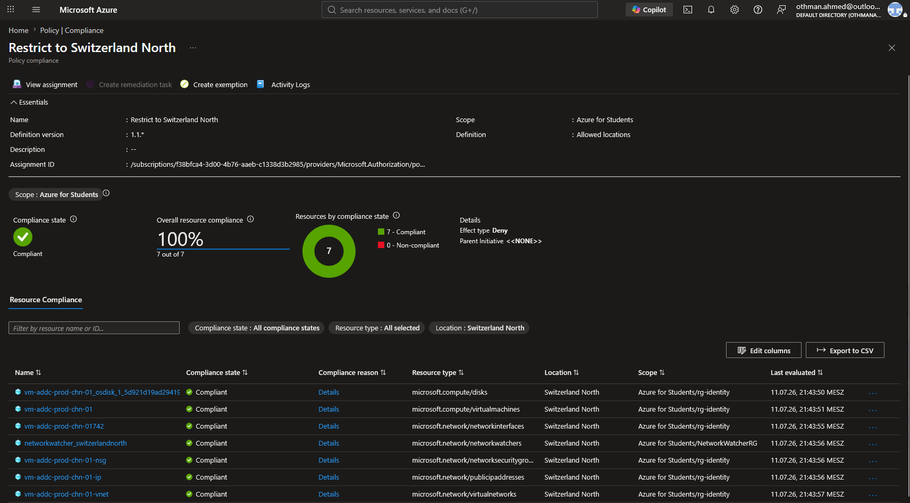


> 💡 **Architectural Note:** Referencing a built-in definition rather than authoring a custom policy from scratch follows the same principle applied when selecting built-in RBAC roles earlier in this project — built-in definitions cover the vast majority of common governance needs, so checking there first is good practice before reaching for custom policy JSON.


---

### Part 3: CLI Equivalent — Region Restriction
For the script library, the same assignment can be created via Azure CLI.

```powershell
cd C:\Users\AHMED\Desktop\Projects\AZ-104\azure-hybrid-identity-lab
code .
```

```powershell
# Get the built-in policy definition ID for "Allowed locations"
az policy definition list --query "[?displayName=='Allowed locations'].{Name:name, DisplayName:displayName}" -o table
```

Expected output shows the definition name — a stable, well-known built-in ID: `e56962a6-4747-49cd-b67b-bf8b01975c4c`.

```powershell
az policy assignment create `
    --name "restrict-region-chn" `
    --display-name "Restrict to Switzerland North" `
    --policy "e56962a6-4747-49cd-b67b-bf8b01975c4c" `
    --params '{ "listOfAllowedLocations": { "value": ["switzerlandnorth"] } }' `
    --scope "/subscriptions/<YOUR-SUBSCRIPTION-ID>"
```

* `--policy` references the built-in definition by its ID rather than writing a custom policy from scratch.
* `--params` — this specific policy takes a parameter (`listOfAllowedLocations`) as a JSON array. Different built-in policies have different parameter schemas, viewable via `az policy definition show --name <id>`.


---

### Part 4: Policy 2 — Mandatory Tagging on Resource Groups
This policy enforces that every Resource Group carries the required CAF tag, keeping governance and cost tracking consistent with the naming convention established for `rg-identity`, `rg-monitoring`, and `rg-workloads`.

1. Portal → **Policy** → **Definitions**.
2. Search the built-in definition: **"Require a tag on resource groups"**.

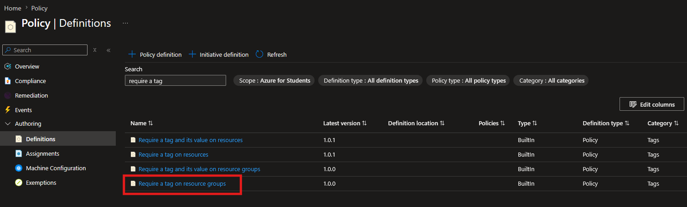

3. Click it → **Assign**.
4. Scope: set to the subscription.

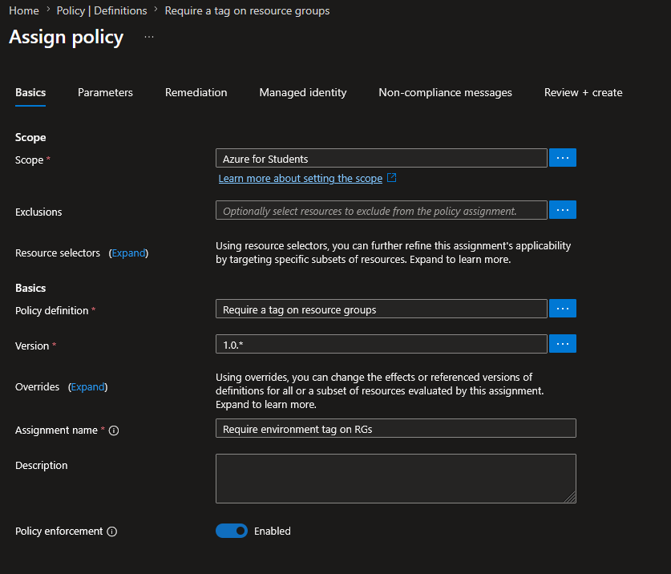

5. Assignment name: `Require Environment tag on Resource Groups`.
6. Go to the **Parameters** tab → *Tag Name* → `Environment`.

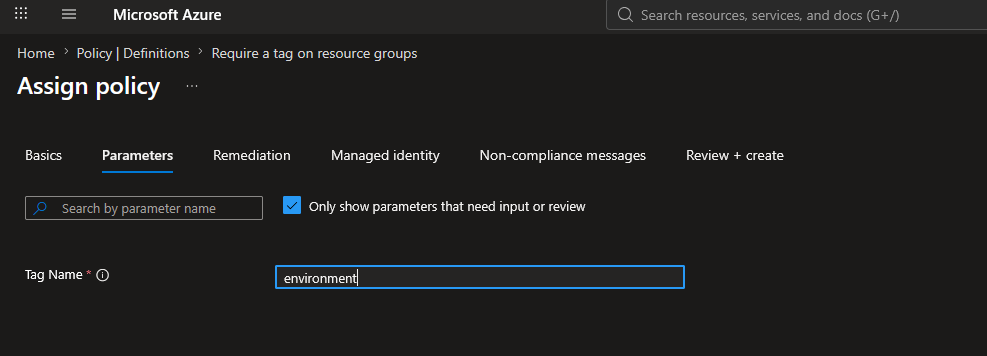

7. Leave the effect at its default (**Deny**) — new Resource Groups missing the tag are blocked outright, matching the state-based enforcement model described in Part 1.
8. Click **Review + Create**.

---

### Part 5: CLI Equivalent — Mandatory Tagging

```powershell
az policy definition list --query "[?displayName=='Require a tag on resource groups'].{Name:name, DisplayName:displayName}" -o table
```

```powershell
az policy assignment create `
    --name "require-tag-rg" `
    --display-name "Require Environment tag on Resource Groups" `
    --policy "96670d01-0a4d-4649-9c89-2d3abc0a5025" `
    --params '{ "tagName": { "value": "Environment" } }' `
    --scope "/subscriptions/<YOUR-SUBSCRIPTION-ID>"
```

---

### Part 6: Policy Check

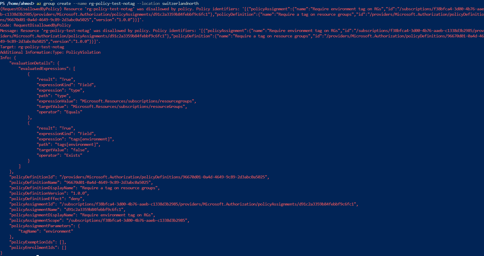


---

### Key Learnings

* **Policy and RBAC are independent, complementary layers.** RBAC gates the *action*; Policy gates the *resulting state*. Neither substitutes for the other.
* **Built-in definitions first.** Both policies used here (`Allowed locations`, `Require a tag on resource groups`) are Microsoft-managed built-ins — no custom policy JSON was needed.
* **Deny effect at creation time** is the strictest enforcement mode — it blocks non-compliant resources outright rather than only flagging them later via a compliance scan.
* **Subscription-level scope** was sufficient for this lab; in a multi-subscription environment, these assignments would move to the Management Group level to apply consistently without reassignment.