# Microsoft Entra Connect Deployment Guide
## Lab Walkthrough: Configuring Hybrid Identity with OU-Level Filtering

This guide documents the implementation of **Microsoft Entra Connect** within a local lab environment. It covers the installation, customization, structural filtering, and validation steps required to synchronize Active Directory Domain Services (AD DS) objects to Microsoft Entra ID.

---

### Part 2: Download Microsoft Entra Connect
On the virtual machine, open the web browser and proceed with retrieving the installation assets.

1. Sign in to the Microsoft Entra admin center: [Microsoft Entra ID](https://entra.microsoft.com/).
2. Expand **Identity** > **Hybrid management**.
3. Select **Microsoft Entra Connect** > **Connect sync**.
4. Select **Download Connect Sync Agent**.
5. Click on **Accept terms & download**.
6. Launch the installer.

> 💡 **Branding Note:** Microsoft has transitioned branding from *Azure AD Connect* to *Microsoft Entra Connect*. The underlying mechanics remain identical, and both names may appear interchangeably depending on the version context.

---

### Part 3: Run the Installer — Express vs. Custom Configuration
Upon launching the wizard, you are presented with two deployment paths: **Express Settings** and **Customize**.

Select **Customize** for this implementation based on the following architectural constraints:
* **Express Settings** requires a verified custom domain and initiates a blanket synchronization of all Organizational Units (OUs) within the Active Directory forest.
* **Customize** allows for explicit configuration of the hybrid authentication method (**Password Hash Sync**) and granular scoping of objects via OU filtering.

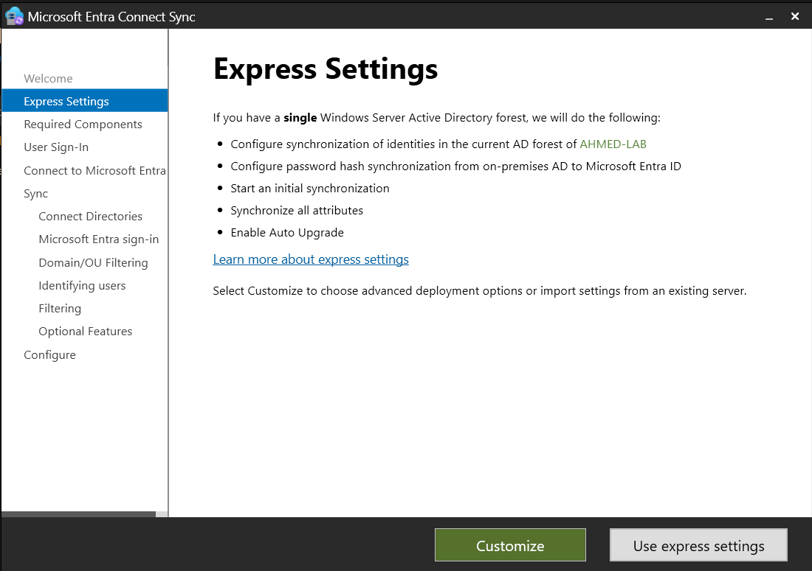

---

### Part 4: Install Required Components
Configure the initial tool prerequisites and local database instances.

1. Maintain the default installation location pathing.
2. Ensure **"Use an existing SQL Server"** is **unchecked**. The wizard will deploy an instance of SQL Server Express LocalDB, which is optimized for lab-scale directory footprints.
3. Ensure **"Specify a custom sync groups"** is **unchecked** to inherit the standard administrative groups.
4. Click **Install** and allow the prerequisite configuration to conclude.

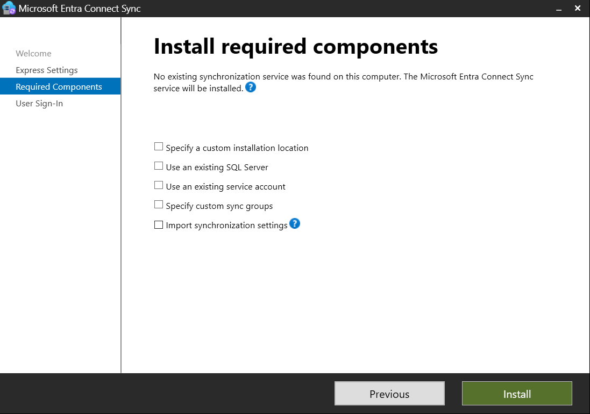

---

### Part 5: User Sign-In Configuration
Select **Password Hash Synchronization** from the available sign-in methods.

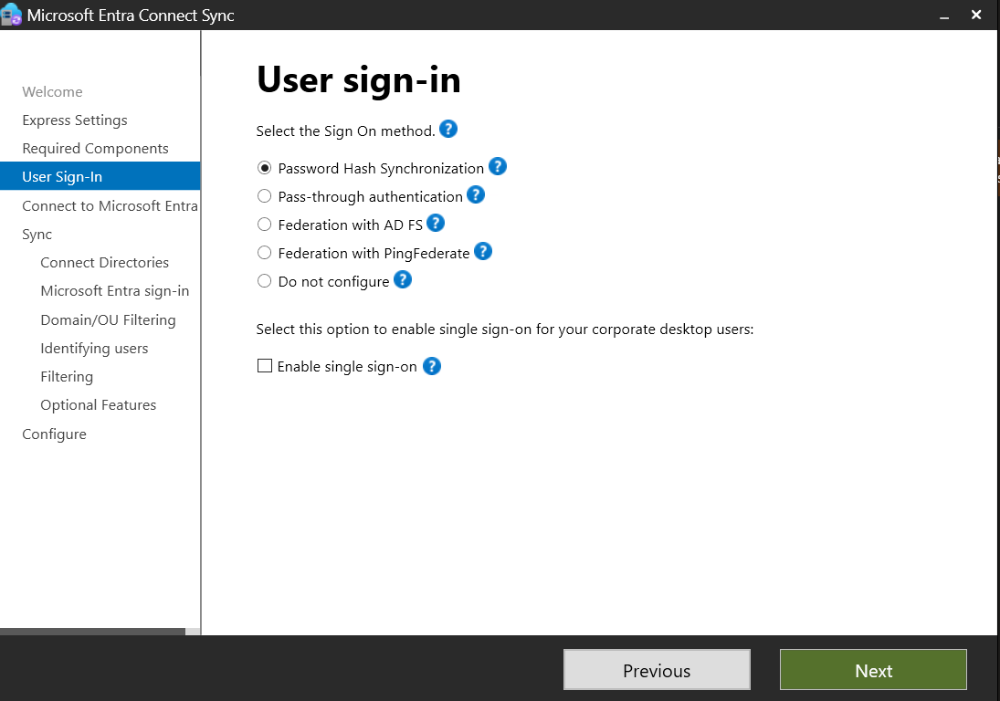

#### 💡 Technical Know-How (AZ-104 Reference)
Understanding the three foundational hybrid identity authentication frameworks is a key objective for enterprise administration and certification paths:

* **Password Hash Sync (PHS):** A hash of the hash of the user's on-premises Active Directory password is synchronized to Microsoft Entra ID. Entra ID handles all authentication requests natively in the cloud. This provides high service resilience since authentication is completely decoupled from the on-premises availability state.
* **Pass-through Authentication (PTA):** Authentication requests are securely validated directly against the on-premises AD via lightweight agents running locally. Passwords never reside in the cloud in any format. This introduces a strong runtime dependency on on-premises infrastructure availability.
* **Federation (AD FS):** Hands over the complete authentication process to a distinct local identity provider (such as Active Directory Federation Services). It supports advanced structural governance or complex requirements but introduces significant operational overhead.

For most standard enterprise deployments and this lab scenario, **PHS** represents the recommended best practice.

* Ensure **"Enable single sign-on"** remains **unchecked** to limit scope creep during this phase.
* Click **Next**.

---

### Part 6: Connect to Microsoft Entra ID
Provide administrative authentication credentials to securely register the local synchronization service with your cloud tenant.

1. Enter your tenant's **Global Administrator** or **Hybrid Identity Administrator** credentials.
2. Click **Next** to complete the cloud handshake authentication.

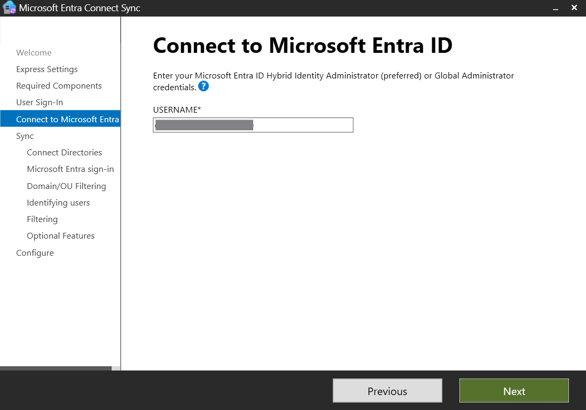

---

### Part 7: Connect Your Directories
Bind your on-premises Active Directory forest instance to the Microsoft Entra Connect configuration.

1. Set the Directory Type field to: **Active Directory**.
2. Set the Forest field to: `ahmed-lab.local`.
3. Click **Add Directory**.
4. Choose **"Create new AD account"** (lets Entra Connect create its own dedicated service account with minimal permissions) — enter your Enterprise Admin credentials (`AHMED-LAB\azureadmin`) to authorize this action.
5. Once verified with a green checkmark under Configured Directories, click **Next**.

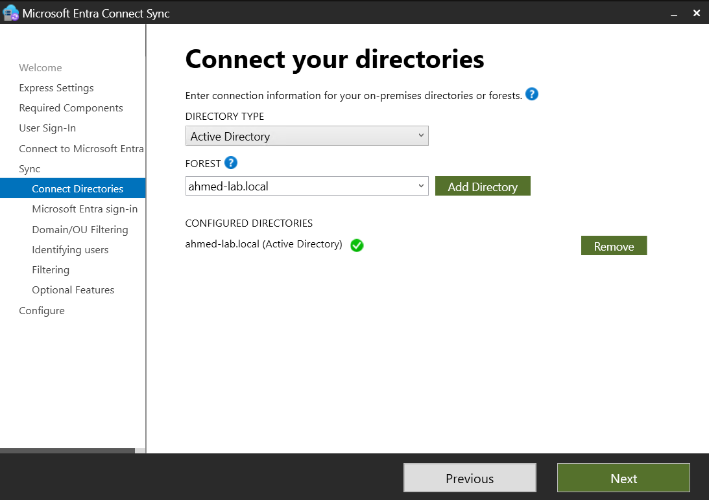

---

### Part 8: Azure AD Sign-In Configuration
Due to the usage of a non-routable local domain layout (`.local`), the engine will trigger a verification validation alert.

1. Notice that `ahmed-lab.local` is marked as **Not Added** for the Microsoft Entra ID Domain.
2. Check the box at the bottom: **"Continue without matching all UPN suffixes to verified domains"**.
3. Click **Next**.

This explicitly bypasses matching limitations for lab testing. Object sync proceeds normally, though production sign-in targeting this suffix would fail without an externally verifiable domain registration matching public UPNs.

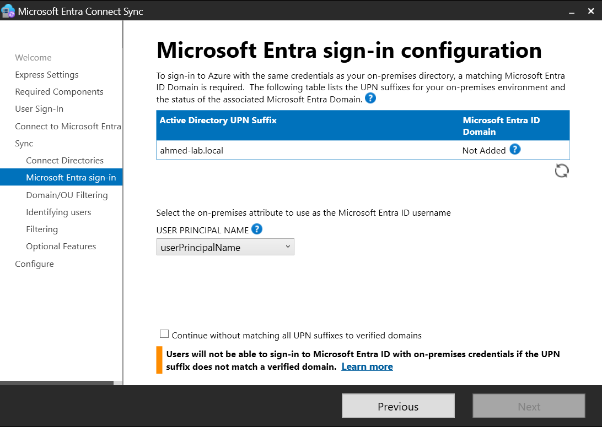

---

### Part 9: Domain and OU Filtering
This section establishes a partial sync pattern, simulating real-world phased enterprise migrations where specific sub-structures are selected for cloud provisioning.

1. Select the radio option: **Sync selected domains and OUs**.
2. Expand the primary domain hierarchy root node (`ahmed-lab.local`).
3. Uncheck the root folder to clear selections, then explicitly check only the **IT** OU folder *(this automatically includes the nested Security OU underneath)*.
4. Ensure the **Sales** and **ServiceAccounts** OUs remain completely unchecked.
5. Click **Next**.

> 💡 **Architectural Note:** This granular scope filtering serves as a standard security and governance control. It restricts cloud visibility to only users who require cloud access while ensuring service accounts and legacy teams remain securely segmented inside the on-premises perimeter.

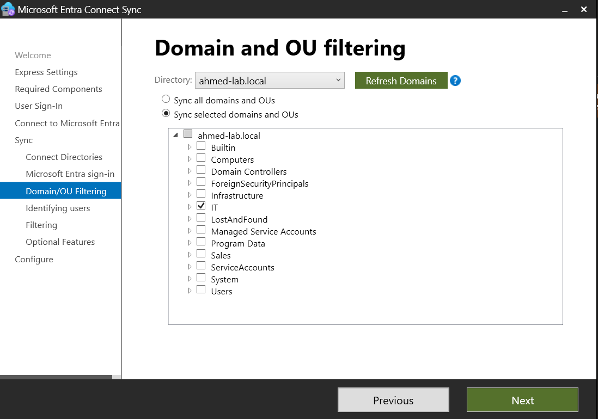

---

### Part 10: Uniquely Identifying Your Users
Define object mapping properties across identity providers.

1. Leave default settings: **Users are represented only once across all directories**.
2. Under source anchor selection, leave default: **Let Azure manage the source anchor** *(which uses ms-DS-ConsistencyGuid as recommended by Microsoft)*.
3. Click **Next**.

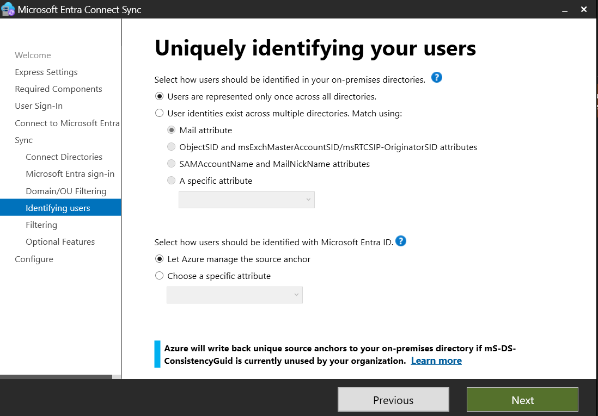

---

### Part 11: Filter Users and Devices
Apply any secondary rules-based object constraints.

1. Maintain the default policy configuration option: **Synchronize all users and devices**.
2. Click **Next**.

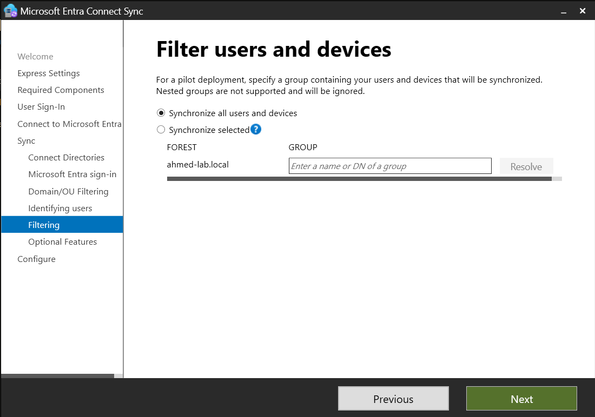

---

### Part 12: Optional Features
Select advanced configuration extensions.

1. Notice that **Password hash synchronization** is automatically selected based on your Part 5 configuration.
2. Leave all other optional features unchecked (*Password Writeback*, *Group Writeback*, etc.), as they are not needed for this lab and some require advanced licensing.
3. Click **Next**.

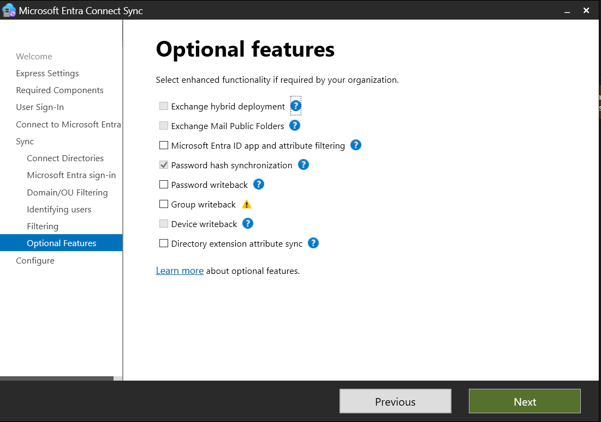

---

### Part 13: Ready to Configure
Final review before executing the local synchronization loops.

1. Review the configuration changes to be applied (targeting your tenant `othmanahmedoutlook.onmicrosoft.com`).
2. Ensure **"Start the synchronization process when configuration completes."** is **checked**. This schedules a delta synchronization immediately following engine configuration.
3. Leave **"Enable staging mode"** unchecked.
4. Click **Install**.

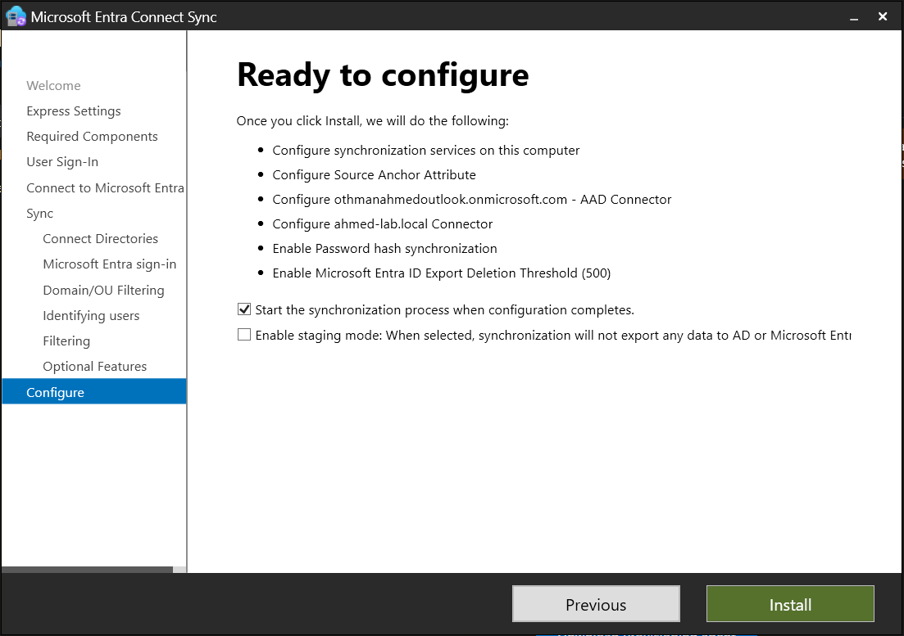

---

### Part 14: Configuration Complete
The configuration wizard tracks deployment progress and displays structural configuration statuses.

1. Verify that the screen displays **"Microsoft Entra Connect Sync configuration succeeded."**.
2. Review the information messages regarding the Active Directory Recycle Bin and the `mS-DS-ConsistencyGuid` source anchor attribute configuration.
3. Click **Exit**.

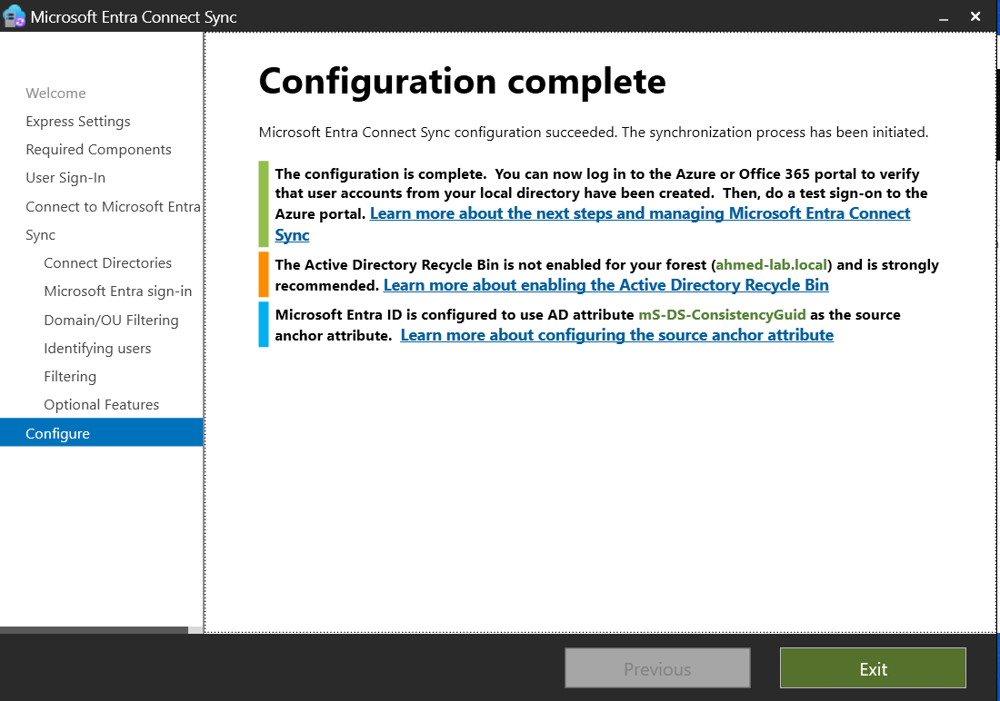

---

### Part 15: Verify Sync — Local Infrastructure Check
Verify that the sync engine successfully completed its cycles locally on the VM.

1. Launch the **Synchronization Service Manager** (search for it in the Start menu).
2. Click on the **Operations** tab.
3. Review the job statuses. You should find successful execution sequences for **Full Import**, **Full Synchronization**, and **Export** complete with **success** or **completed-no-objects** statuses.
4. Inspect the operations targeting both `ahmed-lab.local` and your cloud connector.

---

### Part 16: Verify Sync — Microsoft Entra ID Cloud Portal
Confirm that the on-premises directory structures have correctly updated the cloud tenant directory.

1. Sign in to the portal via browser and go to **Microsoft Entra ID** > **Users** > **All users**.
2. Validate the presence of the 4 target synchronized user records: **Jonas** (`jklein`), **Lisa** (`lmeier`), **Max** (`mbauer`), and **Sara** (`shoffmann`).
3. Inspect the **On-premises synchronization enabled** column. Synced identities will clearly state **Yes** to distinguish them from cloud-native accounts.
4. Audit the directory list to ensure that `aweber` and `tfischer` (members of the **Sales** OU structure) are missing, proving the OU-level structural boundaries were fully applied by the engine.

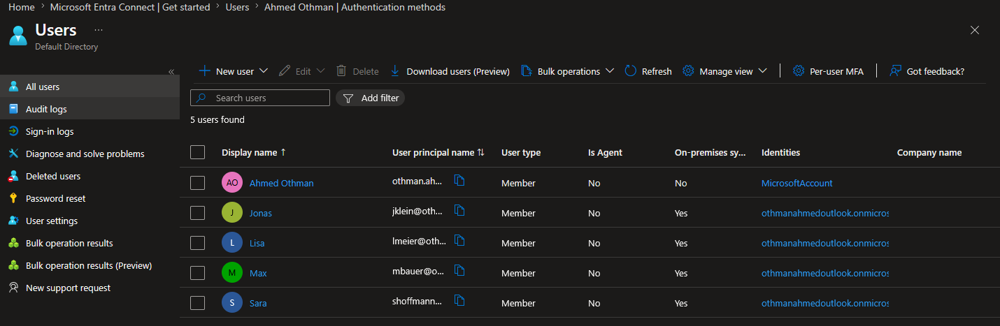